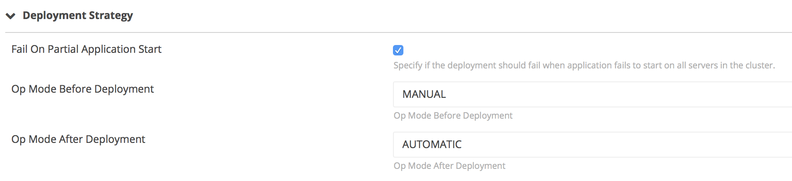
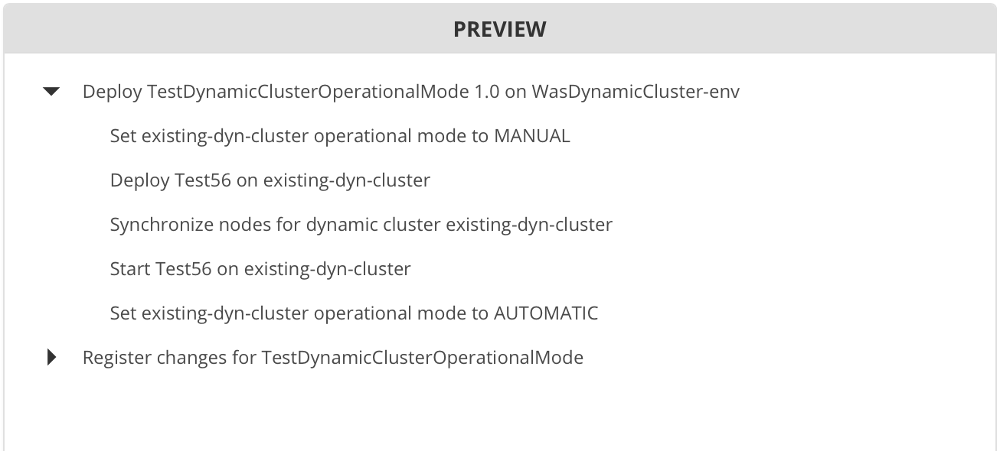

# XL Deploy WebSphere Set-Dynamic-Cluster-Op-Mode plugin v1.0.0

[![Build Status][[xld-was-set-dynamic-cluster-op-mode-plugin-travis-image]][[xld-was-set-dynamic-cluster-op-mode-plugin-travis-url]
[![License: MIT][xld-was-set-dynamic-cluster-op-mode-plugin-license-image]][xld-was-set-dynamic-cluster-op-mode-plugin-license-url]
![Github All Releases][[xld-was-set-dynamic-cluster-op-mode-plugin-downloads-image]

[[xld-was-set-dynamic-cluster-op-mode-plugin-travis-image]: https://travis-ci.org/xebialabs-community/[xld-was-set-dynamic-cluster-op-mode-plugin.svg?branch=master
[[xld-was-set-dynamic-cluster-op-mode-plugin-travis-url]: https://travis-ci.org/xebialabs-community/[xld-was-set-dynamic-cluster-op-mode-plugin
[xld-was-set-dynamic-cluster-op-mode-plugin-license-image]: https://img.shields.io/badge/License-MIT-yellow.svg
[xld-was-set-dynamic-cluster-op-mode-plugin-license-url]: https://opensource.org/licenses/MIT
[[xld-was-set-dynamic-cluster-op-mode-plugin-downloads-image]: https://img.shields.io/github/downloads/xebialabs-community/[xld-was-set-dynamic-cluster-op-mode-plugin/total.svg

## Preface

This document describes the functionality provided by the XL Deploy WebSphere Set-Dynamic-Cluster-Op-Mode plugin.

See the [XL Deploy reference manual](https://docs.xebialabs.com/xl-deploy) for background information on XL Deploy and deployment automation concepts.  

## Overview

This plugin inserts steps to set the Operational Mode of a WAS Dynamic Cluster before and after a deployment.

## Requirements

XL Deploy 4.5+

## Installation

* Copy the latest JAR file from the [releases page](https://github.com/xebialabs-community/xld-was-set-dynamic-cluster-op-mode-plugin/releases) into the `XL_DEPLOY_SERVER/plugins` directory.
* Restart the XL Deploy server.

## Usage

The step(s) to set the operational mode will be inserted into the deployment plan automatically if the OpModeBeforeDeployment and/or OpModeAfterDeployment properties are set.

### Configuration

### Deployment mapping

## References

https://www.ibm.com/support/knowledgecenter/en/SSAW57_8.5.5/com.ibm.websphere.nd.doc/ae/rwve_adtaskdc.html#rwve_adtaskdc__DynamicClusterCommands.cmd20

   